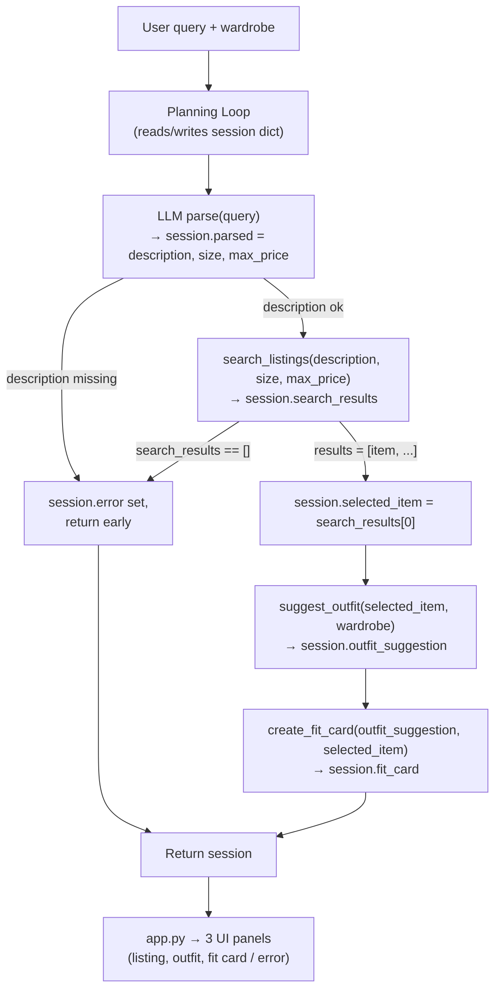

# FitFindr — planning.md

> Complete this document before writing any implementation code.
> Your spec and agent diagram are what you'll use to direct AI tools (Claude, Copilot, etc.) to generate your implementation — the more specific they are, the more useful the generated code will be.
> Your planning.md will be reviewed as part of your submission.
> Update it before starting any stretch features.

---

## Tools

List every tool your agent will use. For each tool, fill in all four fields.
You must have at least 3 tools. The three required tools are listed — add any additional tools below them.

### Tool 1: search_listings

**What it does:**
Filters the listings by size and price, then ranks what's left by how well it matches the description, best match first.

**Input parameters:**
- `description` (str): keywords for what the user wants, for example "vintage graphic tee". This is what gets scored.
- `size` (str | None): the size to filter on. The matching should be loose - as per tools.py, a search for "M" still catches listings labeled "S/M" or "M/L", and the match should also be case-insensitive. No value here (None) means skip the size filter.
- `max_price` (float | None): keep only listings at or below this price. None means don't filter by price.

**What it returns:**
A list of listing dicts, best match first. Each dict has the full listing fields: `id`, `title`, `description`, `category`, `style_tags`, `size`, `condition`, `price`, `colors`, `brand`, `platform`. Listings are ranked by how many distinct description words appear across their text fields (title, description, tags, category, colors, brand), with total mentions breaking ties; common filler words are ignored, and anything with no overlap is dropped.

**What happens if it fails or returns nothing:**
Returns an empty list — never crashes. The planning loop sees the empty list, sets a user-friendly error message, and exits early.

---

### Tool 2: suggest_outfit

**What it does:**
Takes the found item and the user's wardrobe and asks the LLM for one or two outfit combos using stuff they already own.

**Input parameters:**
- `new_item` (dict): the listing the user is considering (same shape as a search result).
- `wardrobe` (dict): `{"items": [...]}` where each item has name, category, colors, style_tags, notes. Can be empty.

**What it returns:**
A string with outfit ideas. If the wardrobe has items, it names specific pieces ("pair with your baggy jeans + white sneakers"). If the wardrobe is empty, it gives general styling advice for the item instead. Never returns an empty string.

**What happens if it fails or returns nothing:**
If the wardrobe is empty it switches to general styling advice for the item instead of trying to name pieces the user owns, so it always comes back with something.

---

### Tool 3: create_fit_card

**What it does:**
Turns the outfit suggestion + item into a short, casual caption you'd actually post with an outfit pic.

**Input parameters:**
- `outfit` (str): the outfit string from `suggest_outfit`.
- `new_item` (dict): the listing, used to drop in the item name, price, and platform.

**What it returns:**
A short caption string (2–4 sentences) that sounds like a real post, not a product description. Mentions the item name, price, and platform once each. Runs at a temperature high enough that different inputs give different captions.

**What happens if it fails or returns nothing:**
If `outfit` is empty or blank, it returns a clear error message string instead of calling the LLM, so it never tries to caption nothing.

---

### Additional Tools (if any)

<!-- Copy the block above for any tools beyond the required three -->

---

## Planning Loop

**How does your agent decide which tool to call next?**

The agent keeps a session dict that holds everything for the run, and each step stores its result back into the session so the next step can read from it.

1. Hand the query to the LLM and ask it to pull out a description, size, and max_price as JSON, and save that to the session. If there's no usable description, set an error and return early.
2. Call search_listings with those parsed values and save the results. If the results are empty, retry with loosened constraints before giving up (stretch — Retry Logic with Fallback): drop the size filter first, then the price limit, then both, stopping at the first attempt that returns matches. If a loosened search succeeds, record what was dropped in `session["adjustment"]` so the user can be told. Only if every loosened attempt is still empty do we set a helpful error message and return early — we never call suggest_outfit with nothing. If there are results, save the top one as the selected item and keep going.
3. Call suggest_outfit with the selected item and the wardrobe, and save the suggestion. (The tool handles an empty wardrobe itself, so it always comes back with something.)
4. Call create_fit_card with that suggestion and the selected item, and save the fit card.
5. Return the session. It's done when the fit card is filled in (success) or an error got set along the way (stopped early at step 1 or 2).

---

## State Management

**How does information from one tool get passed to the next?**

Everything lives in one session dict (from `_new_session`), and tools never talk to each other directly — they read from and write to that dict. The keys it tracks:

- `query` — the raw user string, set at the start.
- `parsed` — `{"description", "size", "max_price"}`, filled in by the LLM parse step.
- `search_results` — the list returned by search_listings.
- `selected_item` — the top match, set to `search_results[0]` (index 0 = best match).
- `wardrobe` — the user's wardrobe dict, passed in at the start.
- `outfit_suggestion` — the string from suggest_outfit.
- `fit_card` — the string from create_fit_card.
- `error` — `None` normally, set to a message if the run stops early.
- `adjustment` — `None` normally, set to a short note (e.g. "removed the size filter") when the search only succeeded after loosening the filters, so the UI can tell the user what changed.

The hand-off works because each tool's output is stored under its own key and the next tool reads from there. For example, search_listings writes to `search_results`, the loop copies `search_results[0]` into `selected_item`, and suggest_outfit reads `selected_item` (plus `wardrobe`) — so the user never re-enters the item. Same chain again: suggest_outfit writes `outfit_suggestion`, and create_fit_card reads `outfit_suggestion` and `selected_item` to build the caption. At the end run_agent returns the whole dict, and app.py pulls `selected_item`, `outfit_suggestion`, `fit_card`, and `error` out of it to fill the three panels.

---

## Error Handling

For each tool, describe the specific failure mode you're handling and what the agent does in response.

| Tool | Failure mode | Agent response |
|------|-------------|----------------|
| search_listings | No results match the query | Returns an empty list (never raises). The loop retries with loosened filters (drop size, then price, then both); if a retry finds matches it continues and records the adjustment for the user. If every loosened attempt is still empty, it sets a helpful error in the session ("nothing matched, try different keywords") and returns early without calling suggest_outfit. |
| suggest_outfit | Wardrobe is empty | Switches to general styling advice for the item instead of naming pieces the user owns, so it still returns a usable string. |
| create_fit_card | Outfit input is missing or incomplete | If `outfit` is empty/blank, returns a clear error message string without calling the LLM. |

---

## Architecture



---

## AI Tool Plan

I plan to use Claude for all of the implementation portions, and providing it my planning.md file and prompting it to ask me any follow up questions before implementing. I will write tests for each component so we can validate the functionality.

**Milestone 3 — Individual tool implementations:**
- search_listings: I'll give Claude the Tool 1 block from this document (the inputs, the return value, the loose/case-insensitive size matching, and the empty-list failure mode) and tell it to use `load_listings()` from utils/data_loader.py. I expect a function that filters by size and max_price, scores by keyword overlap, drops zero-overlap listings, and returns the matches best-first. To verify, I'll check it actually uses all three params and handles the empty case, then run the pytest tests (results found, empty results, price filter) before moving on.
- suggest_outfit: I'll give Claude the Tool 2 block from this document and the wardrobe schema, and ask it to call Groq (specificaly, llama-3.3-70b-versatile) and handle the empty-wardrobe case by switching to general advice that would be supplied by the LLM. I expect a function that always returns a non-empty string. I'll verify by running it once with the example wardrobe and once with the empty wardrobe and confirming both come back with usable text.
- create_fit_card: I'll give Claude the Tool 3 block frmo this doc and ask for a caption that names the item, price, and platform once each and guards against a blank outfit. I expect a short caption string that highlights the item that's being focused on. I'll verify by running it a few times on the same input to confirm the output varies, and once with an empty outfit to confirm it returns the error string instead of crashing.

**Milestone 4 — Planning loop and state management:**
I'll give Claude the Architecture diagram plus the Planning Loop and State Management sections together, and ask it to implement `run_agent()` in agent.py following those steps. I expect code that parses the query, branches on the search result (empty → set error and return early, never calling suggest_outfit), stores each result in the session dict, and returns the session. Before trusting it I'll check that it actually branches instead of calling all three tools every time, that values get written to and read from the session, and then run both cases from agent.py — the happy path (fit card filled in) and the no-results path (error set, fit_card stays None). I'll do the same for `handle_query()` in app.py, giving Claude the State Management section so it maps the session fields to the right panels.


---

## A Complete Interaction (Step by Step)

FitFindr takes a natural-language thrifting request, pulls out the description, size, and price ceiling, and uses them to call `search_listings`, which finds and ranks matching secondhand items — if nothing matches, it tells the user what to try differently and stops rather than passing empty input downstream. When there is a match, the top item flows into `suggest_outfit`, which styles it against the user's saved wardrobe (or gives general styling advice when the wardrobe is empty), and that suggestion flows into `create_fit_card`, which writes a casual, shareable caption. Each tool owns its failure mode — empty search results, an empty wardrobe, or a missing outfit string — so a problem in one step is surfaced to the user instead of crashing the agent.

Write out what a full user interaction looks like from start to finish — tool call by tool call. Use a specific example query.

**Example user query:** "I'm looking for a vintage graphic tee under $30. I mostly wear baggy jeans and chunky sneakers. What's out there and how would I style it?"

**Step 1:** The LLM parses the query into `description="vintage graphic tee"`, `size=None` (no size given), `max_price=30.0`, saved to `session["parsed"]`. The loop then calls `search_listings("vintage graphic tee", None, 30.0)`. Based on that query, the best match is returned first. The loop sets `selected_item = search_results[0]` to be the selected item. Example of what comes back:

```
[
  {"id": "lst_006", "title": "Graphic Tee — 2003 Tour Bootleg Style", "price": 24.0, "condition": "good", "platform": "depop", ...},
  {"id": "lst_033", "title": "Vintage Band Tee — Faded Grey", "price": 19.0, "condition": "fair", "platform": "depop", ...}
]
```

**Step 2:** With an item selected, the loop calls `suggest_outfit(selected_item, wardrobe)` using the example wardrobe. It returns a styling string saved to `session["outfit_suggestion"]`. The user never re-typed the item — it came straight from `selected_item`. Example response:

> "Wear the bootleg graphic tee with your baggy dark-wash jeans and chunky white sneakers — tuck the front hem so it doesn't swallow the waistline. Throw the vintage black denim jacket over it when it cools off. Easy, lived-in 90s streetwear look."

**Step 3:** The loop calls `create_fit_card(outfit_suggestion, selected_item)`, which returns a short caption saved to `session["fit_card"]`. Example response:

> "found this $24 bootleg graphic tee on depop and it's already my whole personality 🖤 baggy jeans + chunky sneakers, denim jacket on standby. thrift wins only"

**Final output to user:** `run_agent` returns the session and app.py fills the three panels — the top listing (title, price, condition, platform), the outfit idea from Step 2, and the fit card from Step 3. (If `search_listings` had come back empty, Step 1 would instead set `session["error"]` and a human readable error would be returned to the user.
